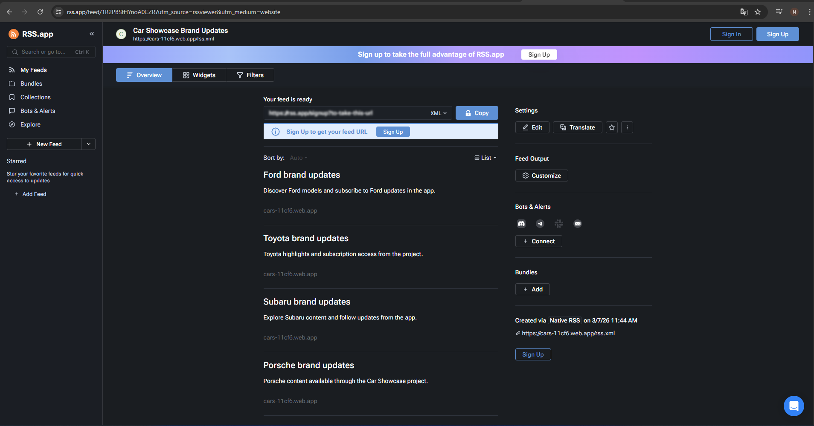

# Car Showcase Web Application

A responsive React web application developed as an educational project.  
This application displays different car brands using reusable components, dynamic JSON data rendering, Firebase authentication, and a real-time community chat system.

---

## Main Page Description

The Home page dynamically renders featured cars from a local JSON data array.

Each car is displayed using a reusable `CarCard` component that receives props.

The layout includes:

- A responsive horizontal scroll section  
- Interactive scroll buttons  
- A navigation Header with dropdown menu  
- A Footer with legal information and internal navigation  
- State management for interactive behavior  

The Home page is accessible via:

- http://localhost:5173  
- http://localhost:5173/home  

---

##  Authentication System

The application includes a full authentication system powered by **Firebase Authentication**.

Users can:

- Register with email and password  
- Log in with existing credentials  
- Log out securely  
- Access protected routes (Chat page)  

Protected routes are handled using a custom `RequireAuth` component.

###  Test Account

If you want to test the chat without registering:

Email: prueba@gmail.com

Password: 123456


---

##  Community Chat (Firebase Firestore)

The project includes a real-time community chat system using **Firebase Firestore**.

Features:

- Messages stored in Firestore database  
- Real-time updates using `onSnapshot`  
- Channel-based filtering (General, Ford, Toyota, Subaru, Porsche, Mitsubishi, Ferrari)  
- Search messages by text or user email  
- Auto-scroll to latest message  
- Only authenticated users can send messages  

This fulfills the requirement of reading and filtering JSON object arrays from Firebase.

---

##  Third-Party Libraries

This project uses:

- React Router DOM  
- Firebase (Authentication + Firestore)  
- React Leaflet  
- Leaflet  
- React Icons  

---

##  Project Structure

src/
│
├── components/
│ ├── header/
│ ├── footer/
│ ├── car-card/
│ ├── auth/
│ └── map/
│
├── pages/
│ ├── home/
│ ├── ford/
│ ├── toyota/
│ ├── about/
│ ├── policy/
│ ├── auth/
│ └── chat/
│
├── context/
├── services/
└── data/


Naming conventions:

- PascalCase → Component files  
- kebab-case → CSS class names  
- camelCase → Variables  
- Boolean variables use prefixes like `is`, `has`, `should`  

---
## Live Demo

The project is deployed with Firebase Hosting:

https://cars-11cf6.web.app

## RSS Feed

The application includes an RSS feed with brand updates available at:

https://cars-11cf6.web.app/rss.xml

Each RSS item links to a real section of the deployed application.

## RSS Reader Screenshot



## Installation & Setup

To run the project locally:

```bash
# Clone the repository
git clone https://github.com/nefta142/cars

# Enter the project directory
cd cars/cars

# Install dependencies
npm install

# Start development server
npm run dev
